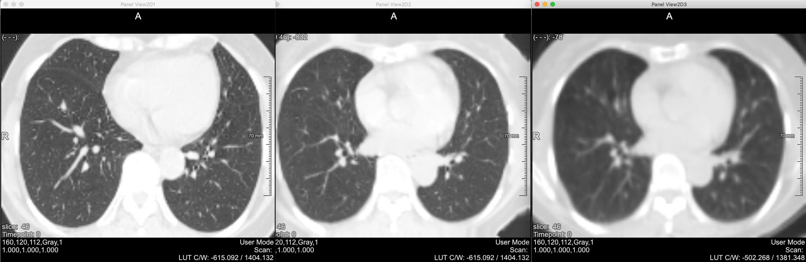
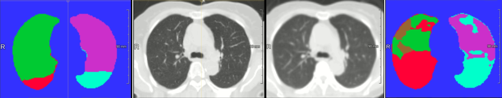
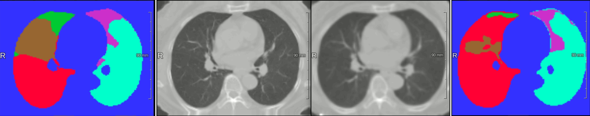
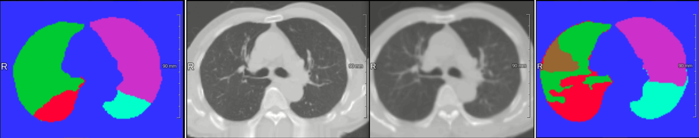

# Accurate Lung Lobes Segmentation in nCECT Image of COPD and Lung Cancer Patients Using Cascaded CNN-based Segmentation and Deformable Registration
(We are finalizing the project and this work has yet to be submitted, therefore, I am not allowed to public the source code but here are some potential results in the pilot study.)   

# Introduction
Lung lobes volume quantification is a crucial phase in the treatment planning for lung cancer or COPD patients. In clinical practice, radiologists still have to manually draw ROIs of each lung lobe in every slice for the volume quantification, which normally takes nearly three hours in average. 

Recently, deep learning-based methods have been successfully applied to automate the segmentation of lung lobes with high precision and therefore reduce the volume quantification time from several hours to merely several minutes. However, state-of-the-art models still face numerous challenges in determining the fissures to distinguish among lobes due to unfavorable features of nCECT images of COPD and lung cancer patients. 

# Dataset
We retrospectively collected 21 pairs of nCECT and CECT images of COPD/lung cancer patients for evaluation, each pair is from the same patient. 

# Method
In this project, we propose a cascaded CNN-based deformable registration and segmentation methods to solve the problem. 

### (1) Deformable Registration Cascade ([CMAN](https://github.com/LocPham263/CMAN)-based Architecture)
The high-resolution lung in CECT image is firstly deformed to match the shape of the low-resolution lung in nCECT image of the same patient. This step significantly enhances the quality of the low-resolution lung, particularly the fissures as well as important features of the lung lobes. 

This is an example of pair-wise deformable lung registration in this work. From left to right, Original CECT image, Deformed CECT image, nCECT image. \

### (2) Segmentation Cascade ([ResUNet](https://github.com/assassint2017/MICCAI-LITS2017)-based Architecture)
After transferring favorable features of the lung CECT image into the lung nCECT image, the deformed lung could be accurately segmented by the segmentation CNN in the cascade.

# Results
Here are some potential visual results of the proposed method. Each row represents a test case, from left to right:
- I2: High-resolution deformed lung in CECT image to match the shape of the low-resolution lung in nCECT image
- I3: Low-resolution lung in nCECT image
- I1: Lung lobes segmentation result of I2
- I4: Lung lobes segmentation result of I3

# Evaluation
To evaluate the performance of the proposed method, we use popular metrics such as DSC, IoU and distance metrics. Experimental results show that the proposed method generally outperforms state-of-the-art methods in all metrics. 
